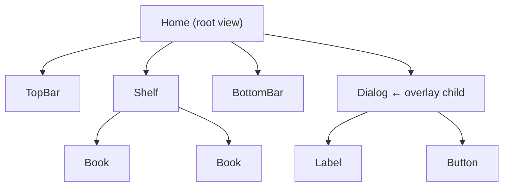
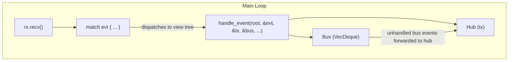
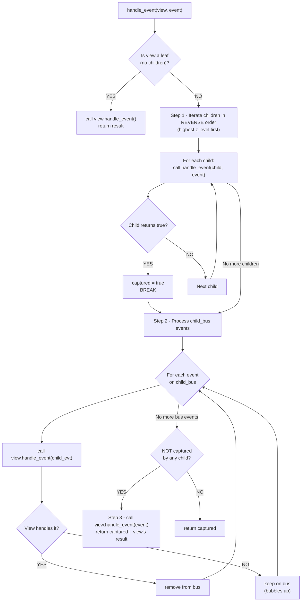
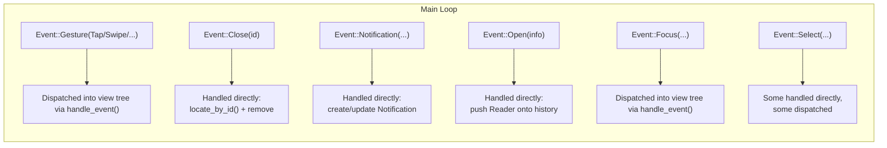
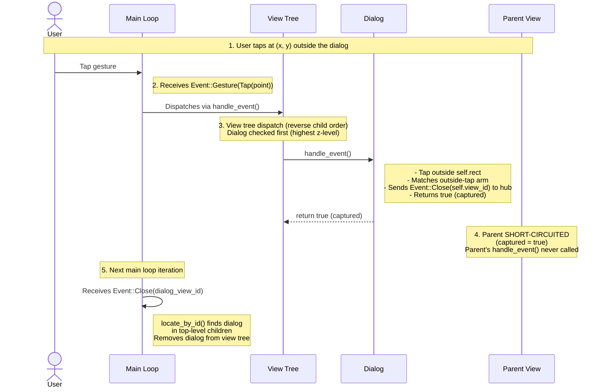
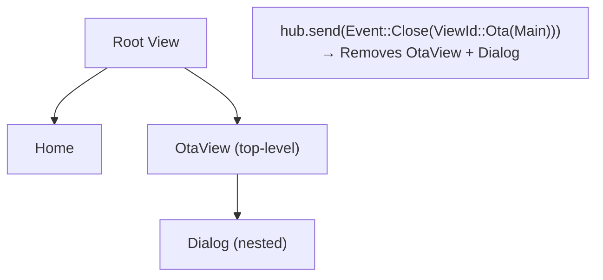
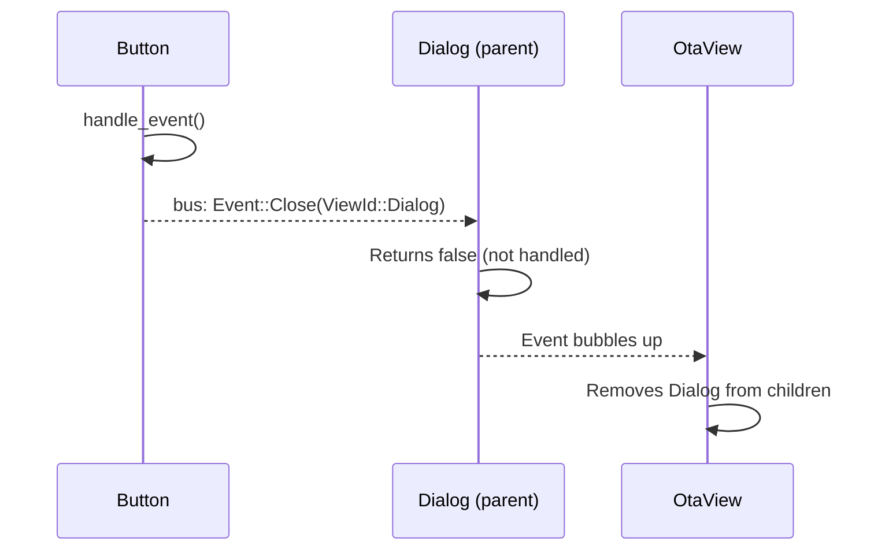

# Event System

Cadmus uses a tree-based event system where views are organized hierarchically and events flow
through two distinct channels: the **Hub** and the **Bus**. Understanding the difference between
these channels is essential for implementing correct event handling in views.

## Overview

The UI is a tree of `View` objects. Each view can have children, forming a hierarchy like:



Events enter the tree from the main loop and travel **top-down** (root to leaves), with the
highest z-level children checked first. Views can communicate back **up** the tree via the bus,
or **globally** via the hub.

## Hub vs Bus

The two channels serve fundamentally different purposes:



### Hub (`Sender<Event>`)

The hub is an `mpsc::Sender<Event>` — a global channel that sends events to the **main loop**.
Events sent to the hub are processed in the **next iteration** of the main loop, not immediately.

**Use the hub when:**

- The event needs to be handled by the main loop directly (e.g., `Event::Close`, `Event::Open`,
  `Event::Notification`)
- The event should reach all views in a future dispatch cycle (e.g., `Event::Focus`)
- You need to communicate across unrelated parts of the view tree

```rust
// Close a view — handled by the main loop's match statement
hub.send(Event::Close(self.view_id)).ok();

// Show a notification — main loop creates the Notification view
hub.send(Event::Notification(NotificationEvent::Show(msg))).ok();

// Set focus — dispatched to all views in the next loop iteration
hub.send(Event::Focus(Some(ViewId::SearchInput))).ok();
```

### Bus (`VecDeque<Event>`)

The bus is a local `VecDeque<Event>` that passes events **from a child to its parent**. Events
placed on the bus are handled synchronously during the current dispatch cycle.

**Use the bus when:**

- A child needs to communicate with its direct parent
- The parent is expected to handle the event (e.g., a button telling its parent dialog it was
  pressed)
- The event should bubble up through the view hierarchy

```rust
// Child tells parent about a submission
bus.push_back(Event::Submit(self.view_id, self.text.clone()));

// Child requests parent to close it
bus.push_back(Event::Close(ViewId::MarginCropper));
```

### Bus Bubbling

When a bus event is not handled by any ancestor view, it reaches the root and gets **forwarded
to the hub** for processing in the next main loop iteration:

```rust
// End of main loop iteration — unhandled bus events become hub events
while let Some(ce) = bus.pop_front() {
    tx.send(ce).ok();
}
```

## Event Dispatch

The core dispatch function in `view/mod.rs` controls how events flow through the tree:



### Key Rules

1. **Reverse iteration**: Children are checked from last to first (highest z-level first). This
   ensures overlays like dialogs and menus receive events before the views beneath them.

2. **Short-circuit on capture**: Once a child returns `true`, no other children or the parent
   view receive the event. This is why the Dialog's outside-tap handler works — it returns `true`
   to prevent the event from reaching views behind it.

3. **Parent only runs if uncaptured**: The parent's `handle_event` is only called if no child
   captured the event (`captured || view.handle_event(...)`). If `captured` is `true`, the
   parent is short-circuited.

## Main Loop Event Handling

The main loop (`app.rs`) receives events from the hub and handles them in a large `match`
statement. Some events are dispatched into the view tree, while others are handled directly:



### Event::Close

`Event::Close(ViewId)` is handled **directly** by the main loop using `locate_by_id()`, which
searches only the **top-level children** of the root view:

```rust
Event::Close(id) => {
    if let Some(index) = locate_by_id(view.as_ref(), id) {
        let rect = overlapping_rectangle(view.child(index));
        rq.add(RenderData::expose(rect, UpdateMode::Gui));
        view.children_mut().remove(index);
    }
}
```

**Key limitation**: The main loop can only remove **direct children of the root**. To close
nested views, either:

1. **Use the parent's ViewId** (via hub): Removes the entire parent container
2. **Use the bus**: Parent handles the close and removes just the specific child

See [Why ViewId Matters for Close](#why-viewid-matters-for-close) and
[Closing Nested Views via the Bus](#closing-nested-views-via-the-bus) for details.

## Practical Example: Dialog Outside-Tap

When a `Dialog` is tapped outside its bounds, the following sequence occurs:



### Why ViewId Matters for Close

When using the **hub** to close views, `locate_by_id()` only finds top-level children. If a
dialog is nested inside a parent, you must use the **parent's** `ViewId` — this removes the
entire parent:



To close just the nested view without affecting siblings, use the **bus** instead (see below).

### Closing Nested Views via the Bus

Send `Event::Close` via the **bus** to close nested views. Parents handle bus events synchronously
and can remove any child directly:

```rust
// Child sends close via bus
bus.push_back(Event::Close(ViewId::Dialog));
```



**Comparison:**

| Method    | Code                              | Handler     | Scope                   |
| --------- | --------------------------------- | ----------- | ----------------------- |
| Hub close | `hub.send(Event::Close(id))`      | Main loop   | Top-level children only |
| Bus close | `bus.push_back(Event::Close(id))` | Parent view | Any child               |

**Example implementation:**

```rust
impl View for Dialog {
    fn handle_event(&mut self, evt: &Event, hub: &Sender<Event>, bus: &mut Bus, ...) -> bool {
        match *evt {
            // Return false to bubble up so grandparent removes us
            Event::Close(ViewId::Dialog) => false,
            _ => false,
        }
    }
}
```

## Summary

| Aspect           | Hub                            | Bus                             |
| ---------------- | ------------------------------ | ------------------------------- |
| Type             | `mpsc::Sender<Event>`          | `VecDeque<Event>`               |
| Scope            | Global (main loop)             | Local (parent-child)            |
| Timing           | Next loop iteration            | Current dispatch cycle          |
| Direction        | View → Main loop               | Child → Parent                  |
| Unhandled events | Processed by main loop `match` | Forwarded to hub                |
| Use for          | Close, Focus, Notifications    | Submit, child-to-parent signals |
