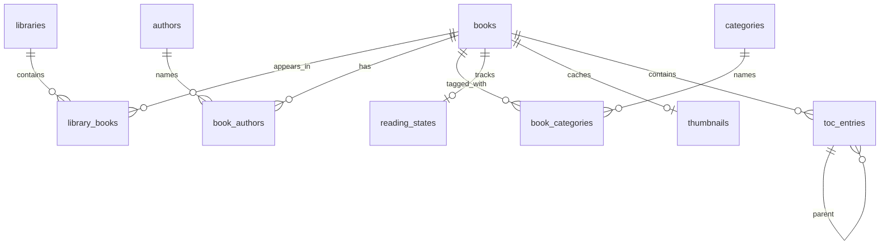
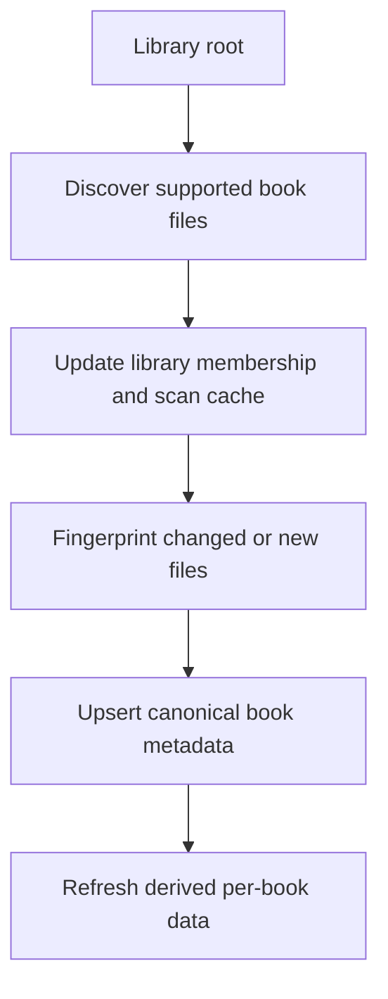

# Library Database

Cadmus stores library roots, scanned files, book metadata, reading progress,
thumbnails, and table-of-contents data in SQLite. This page explains where each
category of library data belongs and how scans move data from disk into the
database.

## Core Shape

The library database separates four concerns:

### Libraries

`libraries` represents scan roots. A row answers: "which directory did Cadmus
index as a library?"

Keep library-level data here only when it describes the library itself, such as
its path, display name, or creation metadata.

### Library Membership

`library_books` connects a library to the book files found under it. It is the
place for data that depends on a specific file within a specific library scan,
including relative paths, absolute paths, timestamps, sizes, and other scan-cache
metadata.

This table is deliberately separate from `books` because one canonical book can
appear in more than one library or at more than one path over time. File-system
state belongs to the membership row, not to the canonical book row.

### Canonical Books

`books` is the canonical per-book record, keyed by fingerprint. It holds data
that should be the same regardless of which library found the file, such as
title and file kind.

Per-book tables reference `books` and are removed with the book when cascading
deletes apply. New per-book data should usually live in a dedicated table rather
than being mixed into library membership.

### Derived Per-Book Data

Authors, categories, reading state, thumbnails, and table-of-contents entries
are derived from either metadata extraction, reader state, or generated assets.
They are tied to the canonical book fingerprint, not to a specific library path.

Use join tables for many-to-many relationships such as authors and categories.
Use child tables for optional or repeatable data such as reading state,
thumbnails, and TOC entries.

## Scan Flow

Library scans move from the filesystem toward canonical book data:

The membership row is checked before expensive work. If the scan-cache data says
the file has not changed, Cadmus can skip re-fingerprinting and metadata
extraction. If the file is new or changed, Cadmus updates the canonical book row
and any derived data collected during import.

## What Goes Where

Use these rules when adding or reviewing library database changes:

| Data kind                               | Belongs in                                           |
| --------------------------------------- | ---------------------------------------------------- |
| Library root path or display name       | `libraries`                                          |
| File path inside one scanned library    | `library_books`                                      |
| File modification or size cache         | `library_books`                                      |
| Stable book identity or extracted title | `books`                                              |
| Data shared by all copies of a book     | `books` or a per-book child table                    |
| Many-to-many metadata                   | Named entity table plus join table                   |
| Reading progress                        | `reading_states`                                     |
| Generated cover image                   | `thumbnails`                                         |
| Nested table of contents                | `toc_entries`, using parent references and positions |
| Migration bookkeeping                   | Migration tables managed by the migration runner     |

If data describes a file's current location, put it in library membership. If it
describes the book identified by its fingerprint, put it in canonical book data
or a per-book child table.

## Schema Details

For exact schema details, read the migrations in `crates/core/migrations/` in
order. They define the tables, views, indexes, constraints, and data migrations
that exist at each database version.

## Data Access

The
<a href="/api/cadmus_core/library/db/struct.Db">`cadmus_core::library::db::Db`</a>
type is the entry point for library database operations. It wraps the shared
SQLite pool and presents a synchronous API to the rest of the app.

Keep database access behind this layer so callers work with domain types instead
of raw SQL rows. For SQLx conventions, type overrides, and migration review
rules, see the related pages below.

## Related Pages

- [SQLite & SQLx](sqlite-sqlx.md) — compile-time query verification and review
  rules
- [Runtime Migrations](runtime-migrations.md) — one-time data migrations using
  the `migration!` macro
