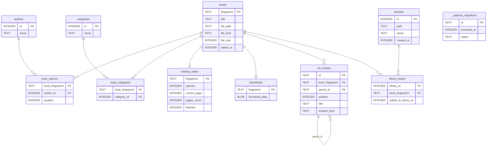
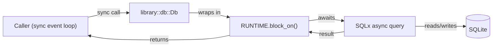
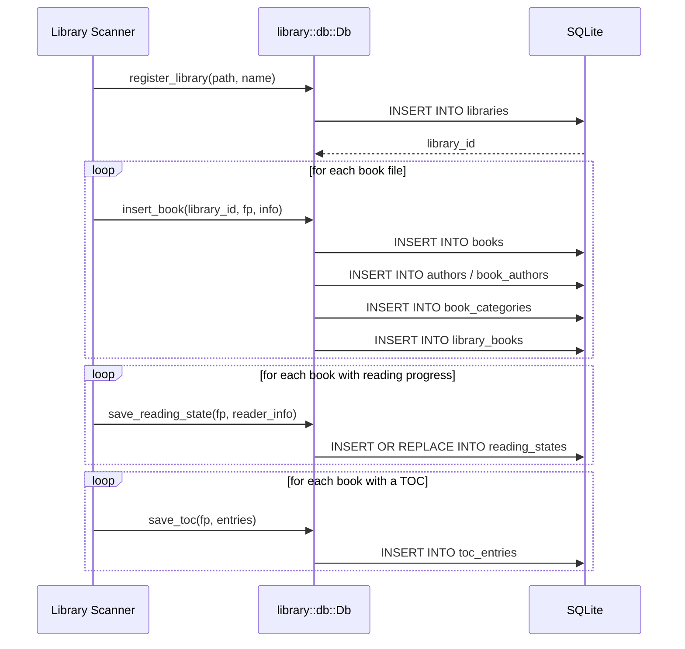

# Library Database

The library subsystem stores all book metadata, reading progress, and
table-of-contents data in SQLite. This page explains the schema, the key
database types, and how data flows from disk into the database.

## Schema overview

The database is created and versioned by the SQL migration files in
`crates/core/migrations/`. The initial schema defines eleven tables plus one
aggregating view:

### Key design choices

- **`books` is the main table.** Every other per-book table references
  `books.fingerprint` with `ON DELETE CASCADE`, so deleting a book row removes
  all associated data automatically.
- **Authors are normalised.** `authors` holds unique author names;
  `book_authors` is the join table and carries a `position` column that
  preserves display order.
- **All tables use `STRICT` mode.** SQLite's `STRICT` pragma enforces column
  type constraints at the storage layer, catching type mismatches early.
- **Timestamps are Unix epoch integers.** `added_at`, `created_at`, and similar
  columns are `INTEGER NOT NULL`; never `TEXT`.
- **TOC tree via adjacency list.** `toc_entries.parent_id` is a self-reference;
  `position` preserves sibling order. The `id` is a UUID7 (generated in Rust) so
  `ORDER BY id ASC` gives stable insertion order without a growing rowid.
- **`library_books_full_info` view.** An aggregating view joins `books`,
  `reading_states`, `book_authors`, `authors`, `book_categories`, and
  `categories` in one query. The `library_id` column from `library_books` is
  exposed so callers can filter with a plain `WHERE library_id = ?`.

## Data access layer

The
<a href="/api/cadmus_core/library/db/struct.Db">`cadmus_core::library::db::Db`</a>
struct is the entry point for all library database operations. It wraps the
shared `SqlitePool` and exposes a **synchronous** API by bridging every async
SQLx call through the global Tokio runtime:

The sync bridge exists because Cadmus's UI event loop is single-threaded and
synchronous. The global `RUNTIME` (a `tokio::runtime::Runtime` singleton) lets
the rest of the codebase call database methods without needing to be async.

Key methods on `Db`:

| Method                                                                                               | Purpose                                              |
| ---------------------------------------------------------------------------------------------------- | ---------------------------------------------------- |
| <a href="/api/cadmus_core/library/db/struct.Db#method.register_library">`register_library`</a>       | Insert a new library row and return its id           |
| <a href="/api/cadmus_core/library/db/struct.Db#method.get_library_by_path">`get_library_by_path`</a> | Look up a library id by filesystem path              |
| <a href="/api/cadmus_core/library/db/struct.Db#method.get_all_books">`get_all_books`</a>             | Fetch every book in a library via the full-info view |
| <a href="/api/cadmus_core/library/db/struct.Db#method.insert_book">`insert_book`</a>                 | Write a new book and its authors/categories          |
| <a href="/api/cadmus_core/library/db/struct.Db#method.save_reading_state">`save_reading_state`</a>   | Save or update reading progress for a book           |
| <a href="/api/cadmus_core/library/db/struct.Db#method.save_toc">`save_toc`</a>                       | Bulk-write a book's table of contents                |
| <a href="/api/cadmus_core/library/db/struct.Db#method.get_thumbnail">`get_thumbnail`</a>             | Retrieve the stored cover thumbnail BLOB             |
| <a href="/api/cadmus_core/library/db/struct.Db#method.save_thumbnail">`save_thumbnail`</a>           | Save or replace a cover thumbnail                    |

## How a book scan flows into the database

When a library directory is scanned, Cadmus follows this sequence:

## Related pages

- [SQLite & SQLx](sqlite-sqlx.md) — compile-time query verification, review rules
- [Runtime Migrations](runtime-migrations.md) — one-time data migrations using
  the `migration!` macro
