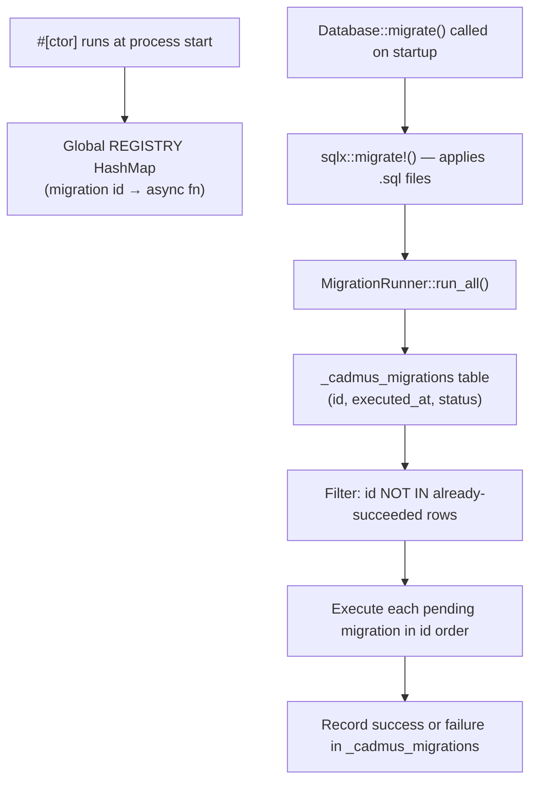

<!-- i18n:skip-start -->

# Runtime Migrations

Cadmus has two distinct migration pipelines:

1. **Schema migrations** — plain `.sql` files in `crates/core/migrations/`,
   applied by SQLx's `migrate!` macro at startup. Use these for `CREATE TABLE`,
   `ALTER TABLE`, and similar DDL changes. The core build script hashes these
   files and embeds the hash in the database version stamp.
2. **Runtime migrations** — Rust `async fn` blocks declared with the
   `migration!` macro. Use these for one-time **data** operations: backfilling
   columns, importing legacy files, cleaning up obsolete rows, or any procedural
   work that goes beyond SQL DDL.

## How runtime migrations work



At process start the `#[ctor]` attribute runs for every `migration!` call and
inserts the migration function into a global `HashMap`. When `Database::migrate`
is called during application startup, it first applies all pending SQL schema
migrations, then calls `MigrationRunner::run_all()`, which:

1. Reads `_cadmus_migrations` and collects IDs that already succeeded.
2. Skips those; runs the remaining ones sorted by ID.
3. Records each result (`success` or `failed`) before moving on.
4. Continues past failures so one broken migration does not block others.

A failed migration can be retried by deleting its tracking row (see
[Re-running a migration](#re-running-a-migration)).

## The `migration!` macro

<a href="/api/cadmus_core/macro.migration">`cadmus_core::migration!`</a> takes a
stable string ID and an `async fn` definition:

```rust
cadmus_core::migration!(
    /// One-line doc comment forwarded to rustdoc.
    "v1_my_migration",
    async fn my_migration(ctx: &mut cadmus_core::db::migrations::MigrationContext<'_>) {
        sqlx::query!("UPDATE books SET title = TRIM(title)")
            .execute(ctx.pool)
            .await?;
        Ok(())
    }
);
```

The macro:

- Generates the `async fn` with the provided body.
- Creates a public submodule named after the function that exposes a
  `MIGRATION_ID` constant — useful for tests and cross-references.
- Registers the function in the global `REGISTRY` via `#[ctor]` so it runs
  automatically without any manual wiring.
- Forwards doc comments onto the generated items so rustdoc picks them up.
- Appends the migration ID and a re-run SQL snippet to the generated docs.

## Where to put migration code

Co-locate migrations with the feature they belong to. The library subsystem's
migrations live in `crates/core/src/library/migrations.rs`; a hypothetical
reader subsystem would put its migrations in
`crates/core/src/reader/migrations.rs`.

The module only needs to be declared once so the `#[ctor]` registration runs.
There is no central registry file to update.

## Writing a migration step by step

### 1. Choose a stable ID

The ID is the primary key in `_cadmus_migrations`. Once a migration has been
deployed it must never be renamed, because existing installations track it by
this string.

Convention: `v<N>_<short_description>`, for example `v1_backfill_book_language`.

### 2. Create the migration file (or add to an existing one)

```rust
// crates/core/src/my_feature/migrations.rs

use cadmus_core::db::migrations::MigrationContext;

cadmus_core::migration!(
    /// Backfills the `language` column for books that were imported before
    /// language detection was added.
    "v1_backfill_book_language",
    async fn backfill_book_language(ctx: &mut MigrationContext<'_>) {
        sqlx::query!(
            "UPDATE books SET language = 'en' WHERE language = '' OR language IS NULL"
        )
        .execute(ctx.pool)
        .await?;

        Ok(())
    }
);
```

### 3. Use SQLx typed macros

All SQL inside a migration must use the typed macros for compile-time
verification (see [SQLite & SQLx](sqlite-sqlx.md)):

```rust
// ✅ Good — compile-time checked
sqlx::query!("DELETE FROM books WHERE file_path = ?", path)
    .execute(pool)
    .await?;

// ❌ Bad — untyped, bypasses verification
sqlx::query("DELETE FROM books WHERE file_path = ?")
    .bind(path)
    .execute(pool)
    .await?;
```

### 4. Make it idempotent

Use `INSERT OR IGNORE`, `ON CONFLICT DO NOTHING`, or guard with a `WHERE` clause
so the migration is safe to re-run without corrupting data.

### 5. Regenerate `.sqlx` metadata

After adding or changing any query in the migration, regenerate the compile-time
metadata:

```bash
cargo sqlx prepare --all --workspace
```

Commit the updated `.sqlx/` files alongside your migration code.

## Re-running a migration

Delete the tracking row, then restart the application:

```sql
DELETE FROM _cadmus_migrations WHERE id = 'v1_my_migration';
```

The next startup will treat the migration as pending and run it again.

## Settings access

`MigrationContext` includes the in-memory <a href="/api/cadmus_core/settings/struct.Settings.html">`Settings`</a>
loaded at startup. Migrations that change settings should mutate `ctx.settings`.

## API reference

- <a href="/api/cadmus_core/macro.migration">`cadmus_core::migration!`</a> —
  macro for declaring runtime migrations
- <a href="/api/cadmus_core/db/migrations/struct.MigrationRunner">`cadmus_core::db::migrations::MigrationRunner`</a> —
  executes all pending registered migrations
- <a href="/api/cadmus_core/db/struct.Database">`cadmus_core::db::Database`</a> —
  owns the connection pool and orchestrates both migration stages

<!-- i18n:skip-end -->
