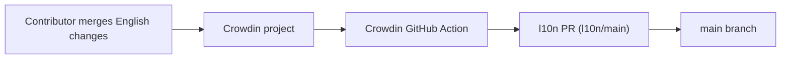

<!-- i18n:skip-start -->

# Translations

## Help translate on Crowdin

The easiest way to contribute translations is on
[Crowdin](https://crowdin.com/project/cadmus). UI strings, the user guide, and
the website are all translated there.

> [!NOTE]
> Direct pull requests to `docs/po/*.po`, `crates/core/i18n/*/*.ftl`, or
> `website/messages/*.json` are discouraged. Crowdin keeps translators
> coordinated and avoids merge conflicts.

## Three translation surfaces

| What                | System           | Source files                              | Crowdin source                 |
| ------------------- | ---------------- | ----------------------------------------- | ------------------------------ |
| Cadmus UI           | [Fluent] FTL     | `crates/core/i18n/<lang>/cadmus_core.ftl` | `crates/core/i18n/en-GB/*.ftl` |
| User guide (mdBook) | GNU gettext PO   | `docs/po/<lang>.po`                       | `docs/po/messages.pot`         |
| Website             | [next-intl] JSON | `website/messages/<lang>.json`            | `website/messages/en.json`     |

The website strings cover the landing page, nav, doc-grid cards, and footer.
The mdBook user guide is a separate, larger translation surface embedded into
the site.

## How Crowdin sync works

- [`crowdin.yml`](https://github.com/ogkevin/cadmus/blob/master/crowdin.yml)
  maps all three English sources to per-locale paths (`%two_letters_code%`).
- [`.github/workflows/crowdin.yml`](https://github.com/ogkevin/cadmus/blob/master/.github/workflows/crowdin.yml)
  runs on pushes to `main` and on pull requests that touch
  `crates/core/i18n/**`, `docs/po/**`, or `website/messages/**`.
- The action uploads sources and existing translations, downloads updates, and
  opens or updates an `l10n/<branch>` pull request labelled `l10n` and
  `crowdin`.
- **Open Crowdin sync PRs:**
  [github.com/ogkevin/cadmus/pulls?q=is%3Aopen+label%3Acrowdin](https://github.com/ogkevin/cadmus/pulls?q=is%3Aopen+label%3Acrowdin)

## How translations are wired at build time

### UI (Fluent)

- English fallback: `en-GB`
  ([`crates/core/i18n/en-GB/cadmus_core.ftl`](https://github.com/ogkevin/cadmus/blob/master/crates/core/i18n/en-GB/cadmus_core.ftl)).
- [`crates/core/src/i18n.rs`](https://github.com/ogkevin/cadmus/blob/master/crates/core/src/i18n.rs)
  embeds FTL files at compile time via `rust-embed` / `i18n_embed`; `fl!()`
  resolves message IDs at compile time.
- [`crates/core/build.rs`](https://github.com/ogkevin/cadmus/blob/master/crates/core/build.rs)
  scans `i18n/` subdirectories and emits `AVAILABLE_LOCALES` for the Settings
  language picker.
- Active language comes from `settings.locale` at startup.

### User guide (gettext / mdBook)

- [`docs/book.toml`](https://github.com/ogkevin/cadmus/blob/master/docs/book.toml)
  `[preprocessor.gettext]` substitutes translated strings during mdBook build.
- `cargo xtask docs` builds one mdBook output per `docs/po/*.po` locale.
- [`docs/lang-picker.js`](https://github.com/ogkevin/cadmus/blob/master/docs/lang-picker.js)
  reads `website/public/_shared/locales.json` for the mdBook sidebar language
  dropdown.

### Website (Next.js / next-intl)

- English source:
  [`website/messages/en.json`](https://github.com/ogkevin/cadmus/blob/master/website/messages/en.json);
  locale files loaded by
  [`website/i18n/request.ts`](https://github.com/ogkevin/cadmus/blob/master/website/i18n/request.ts).
- [`website/scripts/generate-locales.mjs`](https://github.com/ogkevin/cadmus/blob/master/website/scripts/generate-locales.mjs)
  scans `docs/po/*.po` (plus `en`) and writes
  [`website/i18n/locales.generated.ts`](https://github.com/ogkevin/cadmus/blob/master/website/i18n/locales.generated.ts)
  — the website locale list follows the mdBook translation set.
- `cargo xtask docs` orchestrates the full website build: mdBook per locale →
  `generate-locales.mjs` / `generate-version.mjs` → symlinks under
  `website/public/<locale>/guide/` → `next build` → static export at
  `website/out/<locale>/`.
- The language switcher on the landing page
  ([`website/components/language-switcher/`](https://github.com/ogkevin/cadmus/tree/master/website/components/language-switcher))
  routes between locale-prefixed site paths; each locale's `/guide/` subtree is
  the translated mdBook output.

For adding new English source strings or updating the POT template, see
[For developers](developers.md).

[Fluent]: https://projectfluent.org
[next-intl]: https://next-intl.dev

<!-- i18n:skip-end -->
