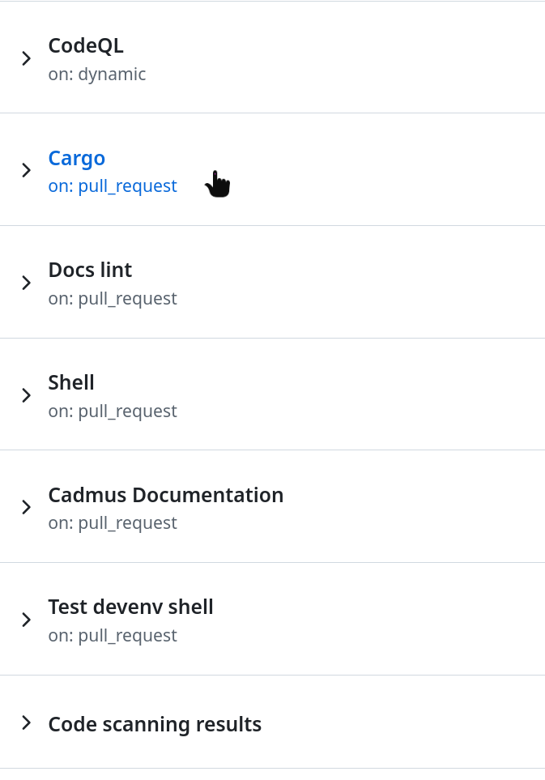

# Manually install PR build

To manually install a PR build, follow these steps:

1. Open the PR you want to install
2. Press the checks tab
   
3. Press the cargo job
   
4. Scroll down until you find the files
   

Afterward, follow the [installation](index.md) instructions accordingly.
