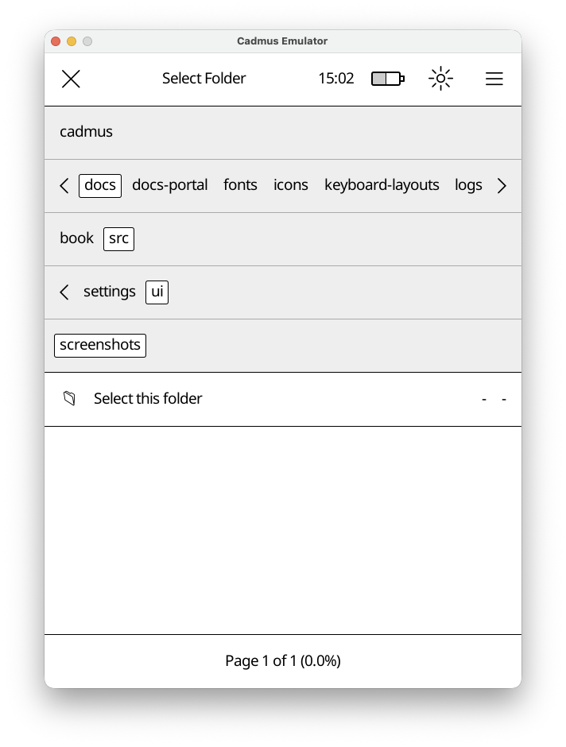

# File Chooser

The file chooser helps you pick files or folders. It appears when you need to
select a file or folder. e.g to pick a screen saver.

## How It Works

The file chooser has three main parts:

1. **Top Bar** - Shows what you're selecting ("Select File", "Select Folder", etc.) and a close button
2. **Navigation Bar** - Shows folders you can tap to browse deeper
3. **File List** - Shows files in the current folder (or a special "Select this folder" option)

## Navigation

Tap any folder name in the navigation bar to open it.
The bar expands automatically if there are many folders.
Tap and drag the separator line below the folders to resize the navigation area.

## Selection Modes

The file chooser adapts based on what you need:

- File selection mode
- Folder selection mode
- File or folder selection mode

The title will indicate the mode.
