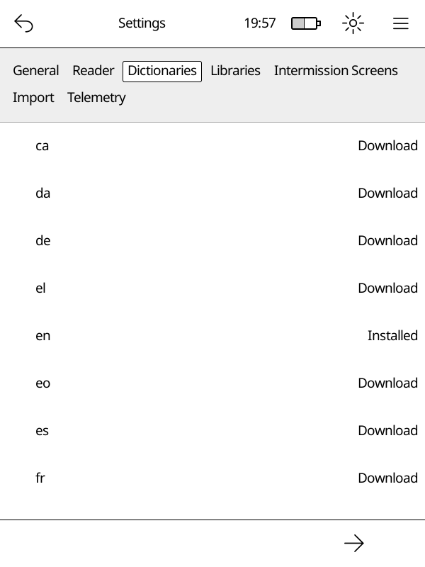

# Dictionaries

Cadmus supports offline word definitions. You can look up any word while
reading by long-pressing it. Dictionaries are stored on your device and work
without an internet connection once downloaded.

Cadmus integrates with [reader-dict](https://github.com/reader-dict/monolingual),
an open-source project that provides high-quality monolingual dictionaries
(where you look up a word and get a definition in the same language) for many
languages.

## Opening the Dictionaries Tab

Go to **Main Menu → Settings → Dictionaries**.

You will see a list of available languages. Each row shows the language code
and its current status.

## Statuses

| Status           | What it means                            |
| ---------------- | ---------------------------------------- |
| Download         | Not yet on your device — tap to download |
| Downloading      | A download is in progress                |
| Installed        | Ready to use                             |
| Update Available | A newer version is available             |

## Downloading a Dictionary

> [!IMPORTANT]
> Your device must be connected to Wi-Fi before you can download a dictionary.

1. Open **Main Menu → Settings → Dictionaries**.
2. Find the language you want.
3. Tap **Download** next to it.

A progress notification appears at the top of the screen while the file
downloads. When it disappears, the dictionary is ready to use.

## Updating a Dictionary

When a newer version is available the status shows **Update Available**.

1. Tap the language row.
2. Select **Update** from the menu.

The updated dictionary replaces the old one automatically.

## Re-downloading a Dictionary

If a dictionary is already installed you can re-download it to get a fresh
copy:

1. Tap the language row.
2. Select **Re-download** from the menu.

## Deleting a Dictionary

1. Tap the language row.
2. Select **Delete** from the menu.

The dictionary files are removed from your device.

## Where Dictionaries are Stored

Downloaded dictionaries live in the `dictionaries/reader-dict/<lang>/`
folder on your device. Each language gets its own subfolder containing a
`.dict.dz` (or `.dict`) and a `.index` file.
