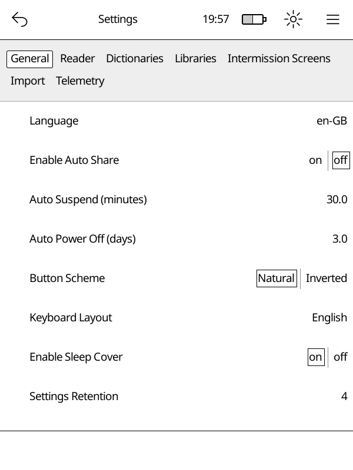

# Settings

The settings editor lets you change how Cadmus works. Open it from **Main Menu
→ Settings**.

Settings are organised into tabs — tap a category to open it.

## Categories

- **General** — language, sleep, auto-suspend, button layout
- **Reader** — what happens when you finish a book
- **Libraries** — add, edit, or remove your book libraries
- **Dictionaries** — download and manage offline dictionaries
- **Import** — control how new books are picked up automatically
- **OTA** — download Cadmus updates directly to your Kobo
- **Telemetry** — logging options
